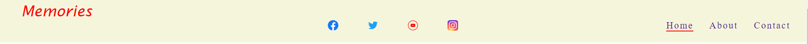

# Memories

Memories is a private members club that makes your dreams come true. We all have a bucket list of things we would like to do in our life time. Most people never get to carry out there dreams whether its going around the world to visit different places, they would never throught they would get to realizee, whether its skiing in the Alps, going to a really big sporting event such as the World Cup, climbing mountain Everest or even swimming with the dolphin. This is where we come in and provide your dreams at a fraction of the cost as an individual wouldn't able to afford to book there dreams adventure. This is done by the way of buying power of the collective in bulk at a cheaper price to our members. By viewing our live site [here] (https://firefox35.github.io/memories/)

## Features

### Site wide

* Navigation Menu
  * It contains links to the Home, About and Contact pages of the website and is responsive to all devices.
  * Plus our four social media platforms - Facebook, Twitter, Instagram and Youtube links that will open in new tabs.
  * This makes it both visually and easy to access for the users to our social media websites.

* Footer
  * It contains links relating to aspects of the business that will open in different tabs

### Home Page

* Information
    * 

![Home Page] (assets/images/memories-home-page.png)

## About Page

* Information

![About Page] (assets/images/about-page.png)

## Contact Page

*Contact Form
  * The implementation of a contact form will allow user to contact Memories for more information.
  * This form with consist of the relative fields and attributes
    * Name (required, type=text)
    * Surname (required, type=text)
    * Email (required, type=text)
    * Message (required, type=text)

![Contact Page] (assets/images/contact-form.PNG)

## Design

* Wireframes - Uizard.io
  * Home Page
    ![Home Page] (assets/images/memories-home-page.png)
  * About Page
    ![About Page] (assets/images/about-page.png)
  * Contact Page
    ![Contact Page] (assets/images/contact-form.png)

## Technologies

* HTML
  * Hypertext Markup Language is the main language to create the structure of the website.
  
* CSS
  * Cascading Style Sheets is used to style your content in an external file.
  
* Github
  * This is used to create a repository to store yor source code as a backup.
  * <https://github.com/firefox35/memories>
  
* Git
  * Git is a language used to submit your code to the repository. 
  
* Uizard.io
  * This application was used to create mockups of the website.
  * <https://app.uizard.io/> 
  * <https://app.uizard.io/prototypes/eJQmj99X0xUXGmmjxlxK>
  
* Webssite Mockup Generator
  * The application was used to create image of the website into a desktop, laptop, tablet and mobile devices.
  * https://websitemockupgenerator.com/ 
  
* Resize Pixel
  * It was used to resize some of the images of the website
  * https://www.resizepixel.com/
  