# Memories

Memories is a private members club that makes your dreams come true. We all have a bucket list of things we would like to do in our life time. Most people never get to carry out there dreams whether its going around the world to visit different places, they would never throught they would get to realizee, whether its skiing in the Alps, going to a really big sporting event such as the World Cup, climbing mountain Everest or even swimming with the dolphin. This is where we come in and provide your dreams at a fraction of the cost as an individual wouldn't able to afford to book there dreams adventure. This is done by the way of buying power of the collective in bulk at a cheaper price to our members. By viewing our live site (https://firefox35.github.io/memories/)

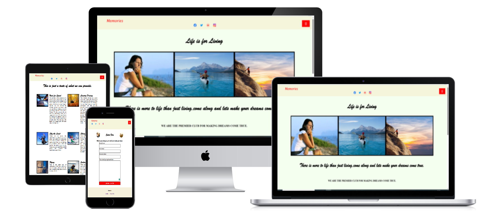

## Features

### Site wide

Navigation Menu
* It contains links in a dropdown menu to the Home, About and Contact pages of the website and is responsive to all devices.
* Plus our four social media platforms - Facebook, Twitter, Instagram and Youtube links that will open in new tabs.
* This makes it both visually and easy to access for the users to our social media websites.

 
Footer
* It contains links relating to aspects of the business that will open in different tabs.
* The content contains links to both Location and Terms of Use Pages.
* When clicked it will bring you to either pages.

   

404 Error 
* Broken Link to page
* Error due wrong code input
* Loading of Map error. 
* Link to Google Maps broken due to wrong URL
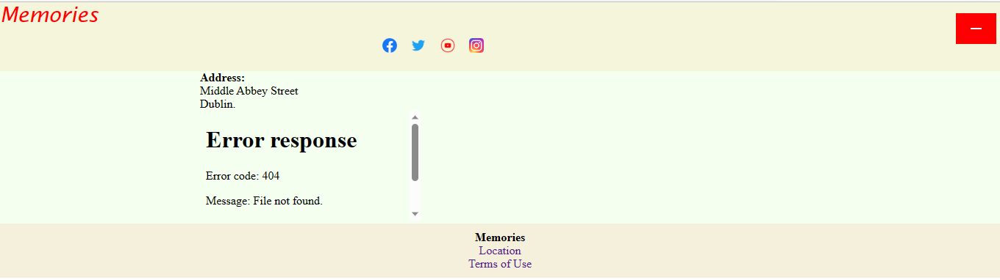

### Home Page

Home Page Images
* This is a collection of images of the user reminiscing on the trips from the past.
* It gives the user a visual display and entices the user to join.
  
Home Page Headlines
* The user is given a written description of the business and make the user intrigued.
  
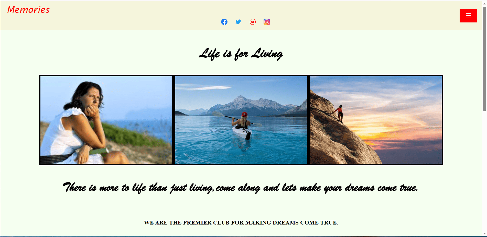

Home Page Values
* The user understands the core key aspect of the business.
* The description of the key values - Commitment, Goals, Mission and Value.

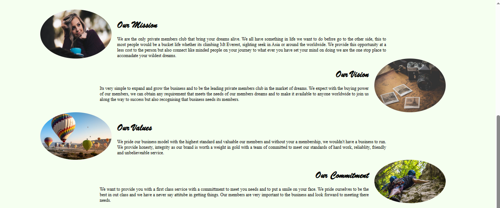

### About Page

* About Page Images
  * The user is displayed with images that might interest them to explore.

* About Page Description
  * This text gives the user some information on what opportunities are available to the user.

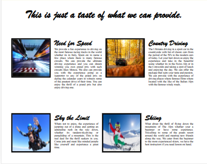

## Contact Page

Contact Form
* The implementation of a contact form will allow user to contact Memories for more information.
* This form with consist of the relative fields and attributes
    * Name (required, type=text)
    * Surname (required, type=text)
    * Email (required, type=text)
    * Message (required, type=text)
* The user then click the button to request some information back.
* The user will be inform of a response from the business in the response page below. 

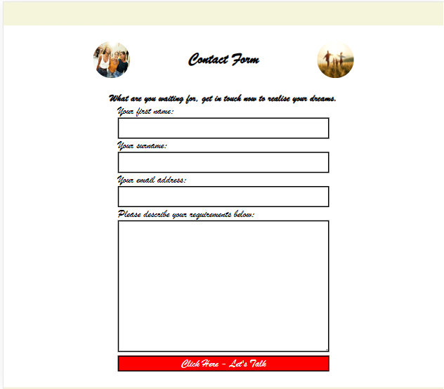

## Response Page

Response Information
* The user will recieve a response regarding the query from the contact form.
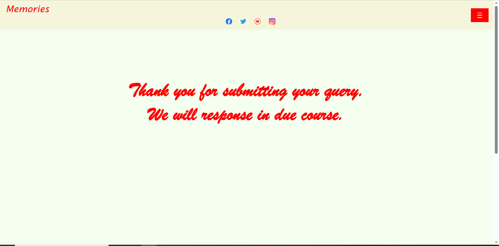

## Extra Features

Terms of Use Page
* The user can view the terms of the business in the terms of us page. 
Location Page
* Google Maps is installed into the location page with address.

## Future Implementation

* Upgrade Stylish Features - Bootstrap.
* Database implementation to collect and store queries from Contact Form.
* Use Javascript to communicate between front-end and back-end.

## Design

Wireframes - Uizard.io
* Home Page

* About Page

    
* Contact Page

## Technologies

HTML
* Hypertext Markup Language is the main language to create the structure of the website.
  
CSS
* Cascading Style Sheets is used to style your content in an external file.
  
Github
* This is used to create a repository to store yor source code as a backup.
* <https://github.com/firefox35/memories>
  
Git
* Git is a language used to submit your code to the repository. 
  
Uizard.io
* This application was used to create mockups of the website.
* https://app.uizard.io/ 
* https://app.uizard.io/prototypes/eJQmj99X0xUXGmmjxlxK
  
Webssite Mockup Generator
* The application was used to create image of the website into a desktop, laptop, tablet and mobile devices.
* https://websitemockupgenerator.com/ 
  
Resize Pixel
* It was used to resize some of the images of the website
* https://www.resizepixel.com/
  
Suppressed Images
* Had to an application to suppress an image to large in size to install. 
* https://www.img2go.com/

Navigation Dropdown List
* https://www.youtube.com/watch?v=7aGLkT4y4ls

## Testing

Responsiveness

Responsiveness was tested on screen sizes from 320px on Chrome, Edge, Firefox and Opera browsers.

Steps to test:

1. Open browser and navigate to [Memories](https://firefox35.github.io/memories/)
2. Open the developer tools (right click and inspect)
3. Set to responsive and decrease width to 320px
4. Set the zoom to 50%
5. Click and drag the responsive window to maximum width

Expected:

No issues regards with overlapping, images and links

Result:

No issue to report.

Accessibility

The following criteria were met for testing:

* All forms with labels or aria-labels to form inputs were working.
* Heading levels are not missed. 
* All navigation links accessibilty.
* Text or titles descriptions are visuable.
* HTML page attribute has been set.
* Aria properties have been implemented correctly.
  
Manual testing performed as expected and accessible.

### Lighthouse Testing

Lighthouse Testing

Home Page
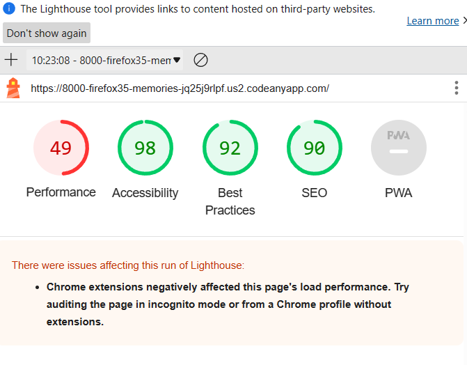
About Page
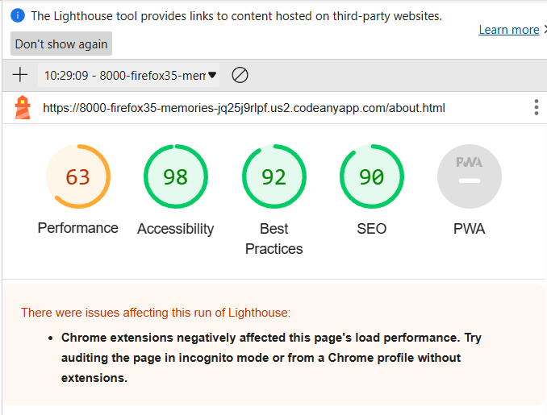
Contact Page
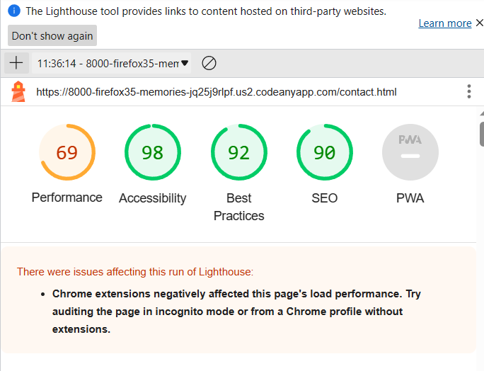

Functional Testing

Navigation Links

* Perform testing was carried out on all navigation links and found to be working perfectly by way of clicking on eack page.
  
  | Navigation Link |  Page to Load |
  |-----------------|---------------|
  |  Home Page      | index.html    |
  |  About Page     | about.html    |
  |  Contact Page   | contact.html  |
  |  Location Page  | location.html |
  |  Terms of Use   | terms.html    |
  |  Response Page  | response.html |

* Form Testing
The form on the contact page was tested to ensure it functionally was correctly working.
The following test scenarios were covered:

Test 2
* Input Data

Steps to test:

1. Navigate to [Memories - Contact Page](https://firefox35.github.io/memories/contact.html)
2. The form is displayed and input the following data into e:
   * First Name: Peter
   * Last Name: Lord
   * Email: peterlord@gmail.com
   * Comment: This is a test.
3. Click Submit
4. User will be redirected to response.html for confirmation.

Expected:

To submit form and get a response back

Result:

No error and worked as expected.

Test 2

* First Name missing
  
Steps to test:

1. Navigate to [Tacos Travels - Home Page](https://firefox35.github.io/memories/contact.html)
2. Scroll down to the form and input the following data:
   * First Name:
   * Last Name: Lord
   * Email: peterlord@gmail.com
   * Comment: This is a test.
3. Click Submit

Expected:

Form should return comment - Fill in box

Result:

Shown as error message was displayed and the form did not submit.

Test 3

* Last Name missing

Steps to test:

1. Navigate to [Tacos Travels - Home Page](https://gareth-mcgirr.github.io/tacos-travels/index.html)
2. Scroll down to the form and input the following data:
   * First Name:Peter
   * Last Name:
   * Email: peterlord@gmail.com
   * Comment: This is a test.
3. Click Submit

Expected:

Error should show and not submit

Result:

Expected result was shown and behaved as expected.

Test 4

* Field Email missing

Steps to test:

1. Navigate to [Tacos Travels - Home Page](https://gareth-mcgirr.github.io/tacos-travels/index.html)
2. Scroll down to the form and input the following data:
   * First Name:Peter
   * Last Name: Lord
   * Email:
   * Comment: This is a test.
3. Click Submit

Expected:

The form should show error and not submit

Result:

As expected shown error and not submitting

Test 6
* Email format incorrect

Steps to test:

1. Navigate to [Memories - Contact Page](https://gareth-mcgirr.github.io/tacos-travels/index.html)
2. Scroll down to the form and input the following data:
   * First Name:John
   * Last Name: Doe
   * Email: pete.loed@gmail.com
   * Comment: This is a test.
3. Click Submit

Expected:

Will shown error as comment not valid email address

Result:

Form shown invalid email address as expected.

* Header Social Media Icons/Links
* Footer Contact Information
Validation Testing
* HTML
    * index.html
    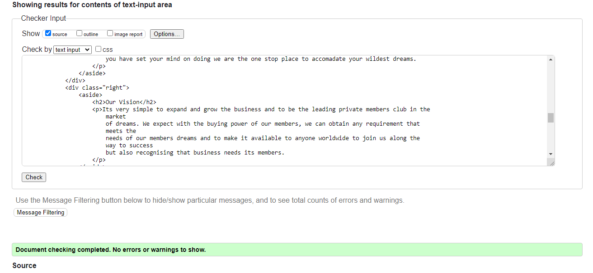
    * about.html
    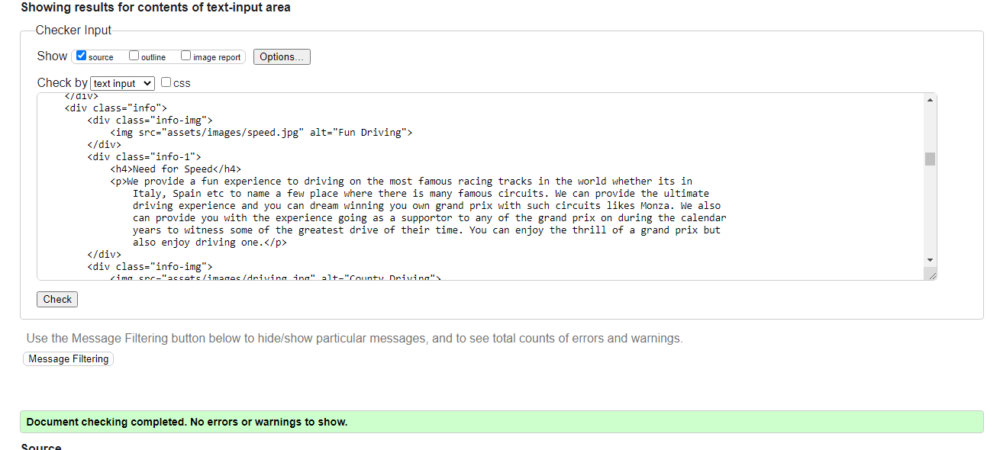
    * contact.html
    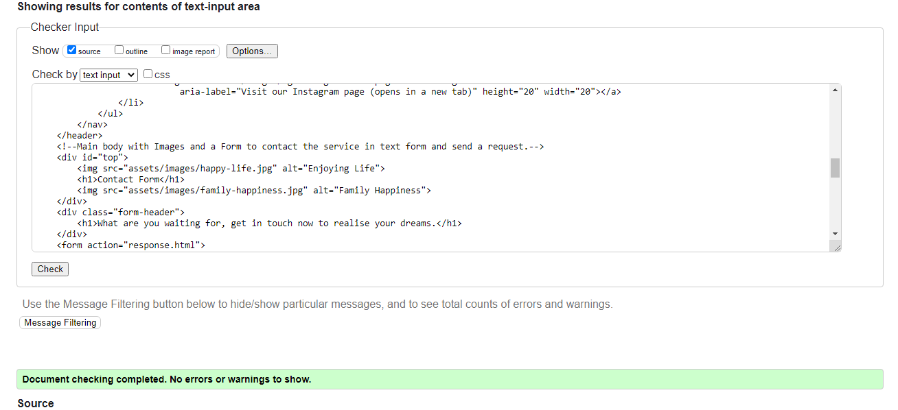
    * location.html
    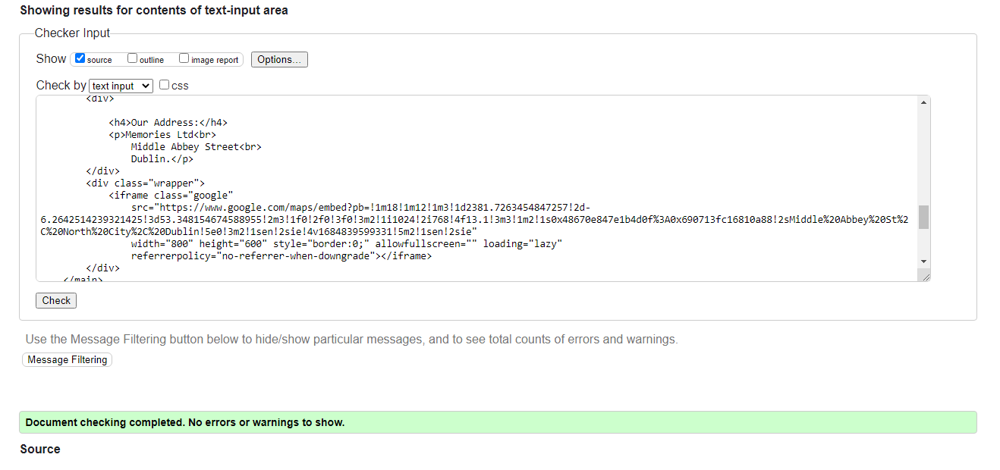
    * terms.html
    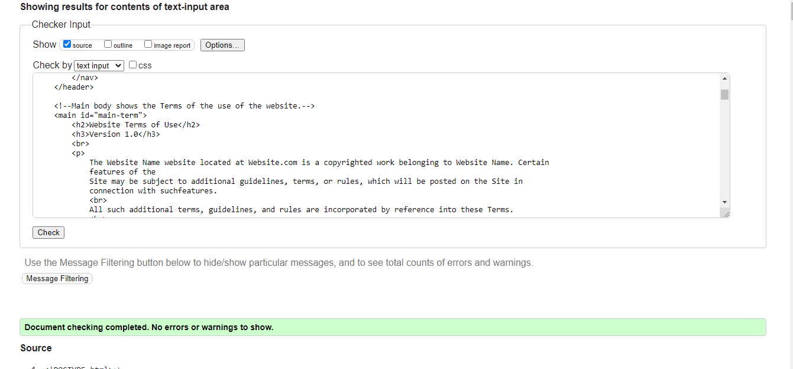
    * response.html
    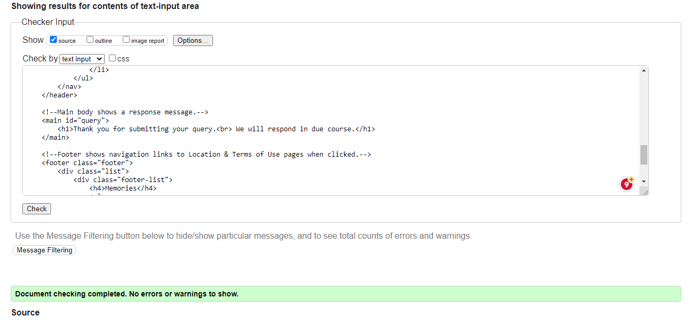

CSS 
* styles.css
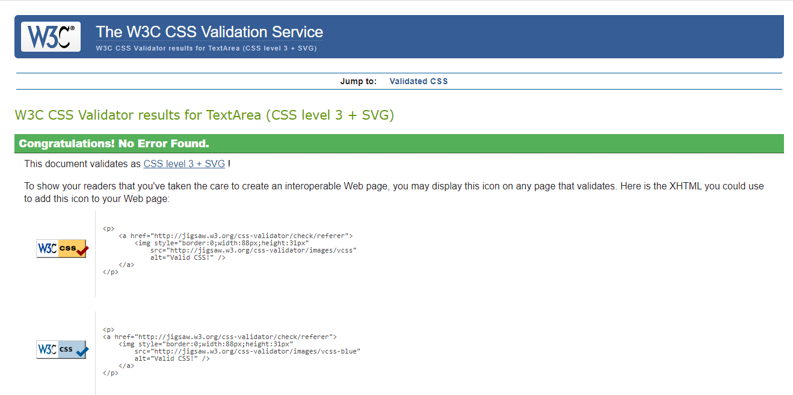

Unfixed Bugs 

* Responsiveness of the website worked on all devices and screen sizes 

## Deployment

Version Control
* The website was created using CodeAnyWhere editor and the code was pushed to a repository in GitHub called Memories.

* I used the following GitHub commands to push the code to the repository, everytime a chance is made to the code. This is what they called version control. Its basically a backup version of your code if anything goes wrong.
    
* git add <file> - This command is basically saving your code 
* git commit -m "Commit Message" 
* git push

Deployment of Live Version from GitHub 

* The site was deployed to GitHub pages. The steps to deploy are as follows:
* In the GitHub repository, navigate to the Settings tab
* From the menu on left select 'Pages'
* From the source section drop-down menu, select the Branch: main
* Click 'Save'
* A live link will be displayed in a green banner when published successfully.

The live link can be found here - <https://firefox35.github.io/memories/>

Clone the Responsitory Code Locally

* Click on the code drop down button
* Click on HTTPS
* Copy the repository link to the clipboard
* Open your IDE of choice (git must be installed for the next steps)
* Type git clone copied-git-url into the IDE terminal

The project will now of been cloned on your local machine for use.

Credits

* Links for Images and Content used in the website. 
* Cars
    * https://hiconsumption.com/fastest-cars-in-the-world/
    * https://www.drive-in-motion.com/en/sports-car-tour/sports-car-black-forest-experience

* Skydiving
    * https://www.whatsonincork.com/aerial-sports/
    * https://skydivecalifornia.com/blog/is-skydiving-safe/

* Paragliding
    * https://skywings.ch/

* Skiing
    * https://www.thetimes.co.uk/travel/ski/the-most-snowsure-ski-resorts-in-europe
    * https://www.clubmed.co.th/l/blog/different-types-of-skiing
    * Kid Skiing
    * https://thesnowschool.co.uk/skiing-with-young-children/

* Adventure
    * https://pixabay.com/images/search/adventure/

* Life
    * https://www.goodtherapy.org/blog/20-cognitive-distortions-and-how-they-affect-your-life-0407154
    * https://www.betterhelp.com/advice/general/what-to-do-if-you-are-thinking-of-someone/
    * https://reallifecounseling.us/anxiety-thinking/

* Videos
    * https://www.youtube.com/watch?v=eQspTn9pZAo
    * https://www.youtube.com/watch?v=vuN88hXFqak

* City Breaks
    * https://www.hellomagazine.com/travel/20220707140740/best-european-city-breaks/

* Sailing
    * https://www.yachtingworld.com/uncategorized/dinghy-sailing-why-its-great-for-beginners-and-keelboat-sailors-139251
    * https://sebastus.com/top-sailing-destinations-on-the-spanish-coast/
    * https://insailing.com/blog/girls-in-sailings

* Opera
    * https://www.timeout.com/newyork/news/phantom-of-the-opera-is-closing-on-broadway-091622

* Sightseeing
    * https://www.viator.com/en-IE/tours/Rome/Rome-Hop-On-Hop-Off-Sightseeing-Tour/d511-6980ROME

* Sporting Events
    * https://www.1sports1.com/sports-bucket-list/

* Climbing
    * https://www.99boulders.com/beginner-climbing-tips
    * https://www.sierraclub.org/sierra/rock-climbing-bad-for-cliffs
    * https://www.visittucson.org/things-to-do/outdoors/rock-climbing/

* Happiness
    * https://www.awarenessdays.com/awareness-days-calendar/international-day-of-happiness-2023/
    * https://www.houseofwellness.com.au/wellbeing/mental-wellness/secret-lifelong-happiness
