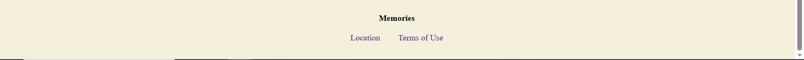
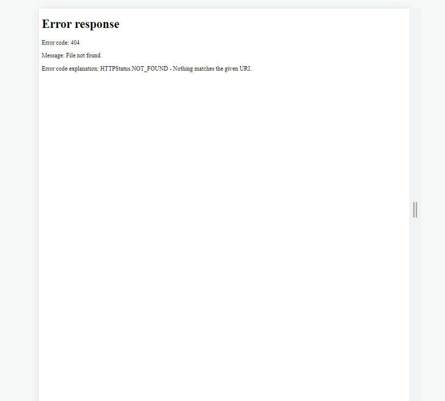
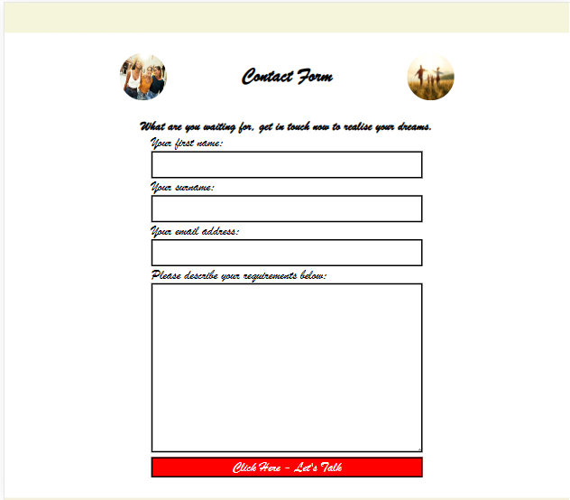
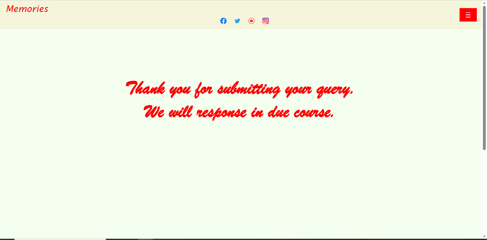
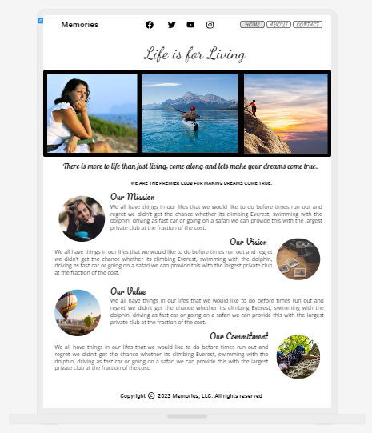
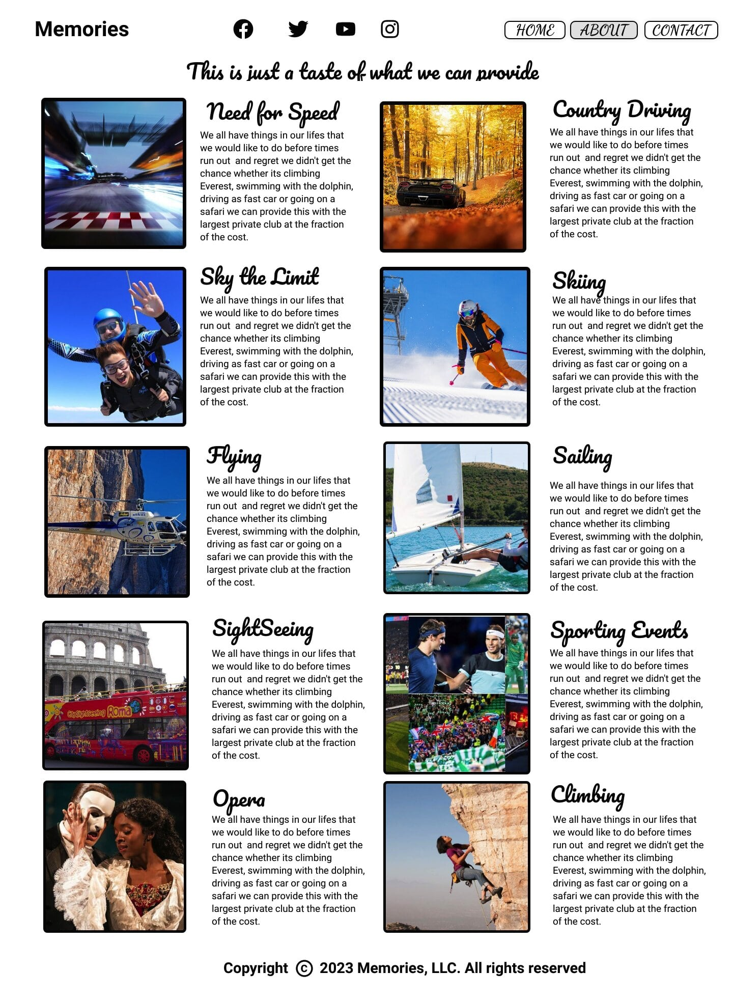
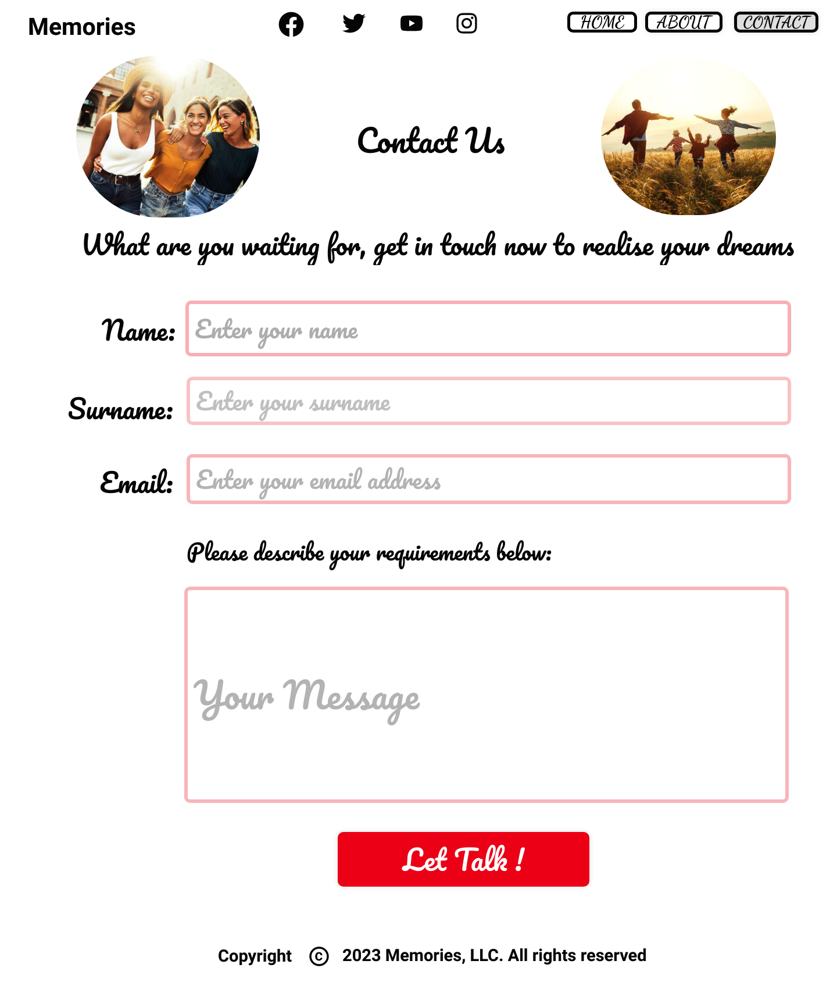

# Memories

Memories is a private members club that makes your dreams come true. We all have a bucket list of things we would like to do in our life time. Most people never get to carry out there dreams whether its going around the world to visit different places, they would never throught they would get to realizee, whether its skiing in the Alps, going to a really big sporting event such as the World Cup, climbing mountain Everest or even swimming with the dolphin. This is where we come in and provide your dreams at a fraction of the cost as an individual wouldn't able to afford to book there dreams adventure. This is done by the way of buying power of the collective in bulk at a cheaper price to our members. By viewing our live site (https://firefox35.github.io/memories/)

## Features

### Site wide

* Navigation Menu
  * It contains links in a dropdown menu to the Home, About and Contact pages of the website and is responsive to all devices.
  * Plus our four social media platforms - Facebook, Twitter, Instagram and Youtube links that will open in new tabs.
  * This makes it both visually and easy to access for the users to our social media websites.

 
* Footer
  * It contains links relating to aspects of the business that will open in different tabs.
  * The content contains links to both Location and Terms of Use Pages.
  * When clicked it will bring you to either pages.

* 401 Error Occurred
 

### Home Page

* Home Page Images
    * This is a collection of images of the user reminiscing on the trips from the past.
    * It gives the user a visual display and entices the user to join.
  
* Home Page Headlines
   * The user is given a written description of the business and make the user intrigued.
  

* Home Page Values
   * The user understands the core key aspect of the business.
   * The description of the key values - Commitment, Goals, Mission and Value.

## About Page

* About Page Images
  * The user is displayed with images that might interest them to explore.

* About Page Description
  * This text gives the user some information on what opportunities are available to the user.

## Contact Page

* Contact Form
  * The implementation of a contact form will allow user to contact Memories for more information.
  * This form with consist of the relative fields and attributes
    * Name (required, type=text)
    * Surname (required, type=text)
    * Email (required, type=text)
    * Message (required, type=text)
  * The user then click the button to request some information back.
  * The user will be inform of a response from the business in the response page below. 

## Response Page

* Response Information
    * The user will recieve a response regarding the query from the contact form.
  

## Extra Features

* Terms of Use Page
  * The user can view the terms of the business in the terms of us page. 
* Location Page
  * Google Maps is installed into the location page with address.

## Future Implementation

* Upgrade Stylish Features - Bootstrap.
* Database implementation to collect and store quiries from Contact Form.
* Use Javascript to communicate between front-end and back-end.

## Design

* Wireframes - Uizard.io
  * Home Page
    

  * About Page
    
    
  * Contact Page
    

## Technologies

* HTML
  * Hypertext Markup Language is the main language to create the structure of the website.
  
* CSS
  * Cascading Style Sheets is used to style your content in an external file.
  
* Github
  * This is used to create a repository to store yor source code as a backup.
  * <https://github.com/firefox35/memories>
  
* Git
  * Git is a language used to submit your code to the repository. 
  
* Uizard.io
  * This application was used to create mockups of the website.
  * https://app.uizard.io/ 
  * https://app.uizard.io/prototypes/eJQmj99X0xUXGmmjxlxK
  
* Webssite Mockup Generator
  * The application was used to create image of the website into a desktop, laptop, tablet and mobile devices.
  * https://websitemockupgenerator.com/ 
  
* Resize Pixel
  * It was used to resize some of the images of the website
  * https://www.resizepixel.com/
  
* Suppressed Images
  * Had to an application to suppress an image to large in size to install. 
  * https://www.img2go.com/

* Navigation Dropdown List
  * https://www.youtube.com/watch?v=7aGLkT4y4ls

  ## Testing

  * Responsiveness
  * Accessibility
  * Lighthouse Testing
  * Functional Testing
    * Navigation Links
    * Form Testing
    * Header Social Media Icons/Links
    * Footer Contact Information
  * Validation Testing
    * HTML
    * CSS 
  * Unfixed Bugs  

  ## Deployment

* Version Control
  * The website was created using CodeAnyWhere editor and the code was pushed to a repository in GitHub called Memories.

  * I used the following GitHub commands to push the code to the repository, everytime a chance is made to the code. This is what they called version control. Its basically a backup version of your code if anything goes wrong.
    
  * git add <file> - This command is basically saving your code 
  * git commit -m "Commit Message" 
  * git push

* Deployment of Live Version from GitHub 
  
* Clone the Responsitory Code Locally
  
* Credits
  * Links for Images and Content used in the website. 